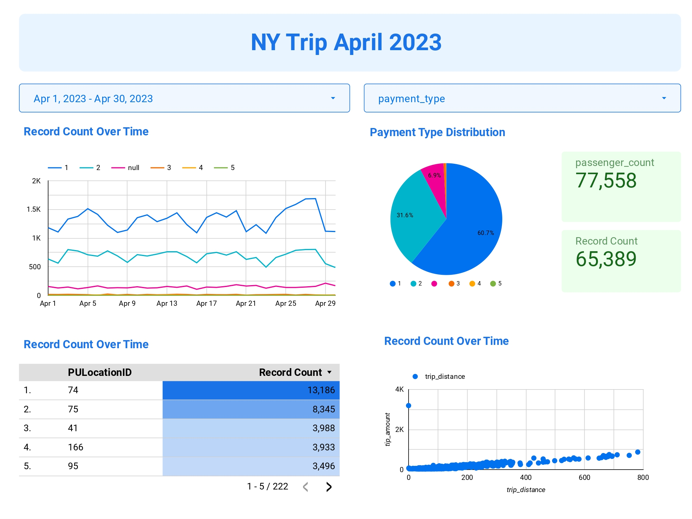
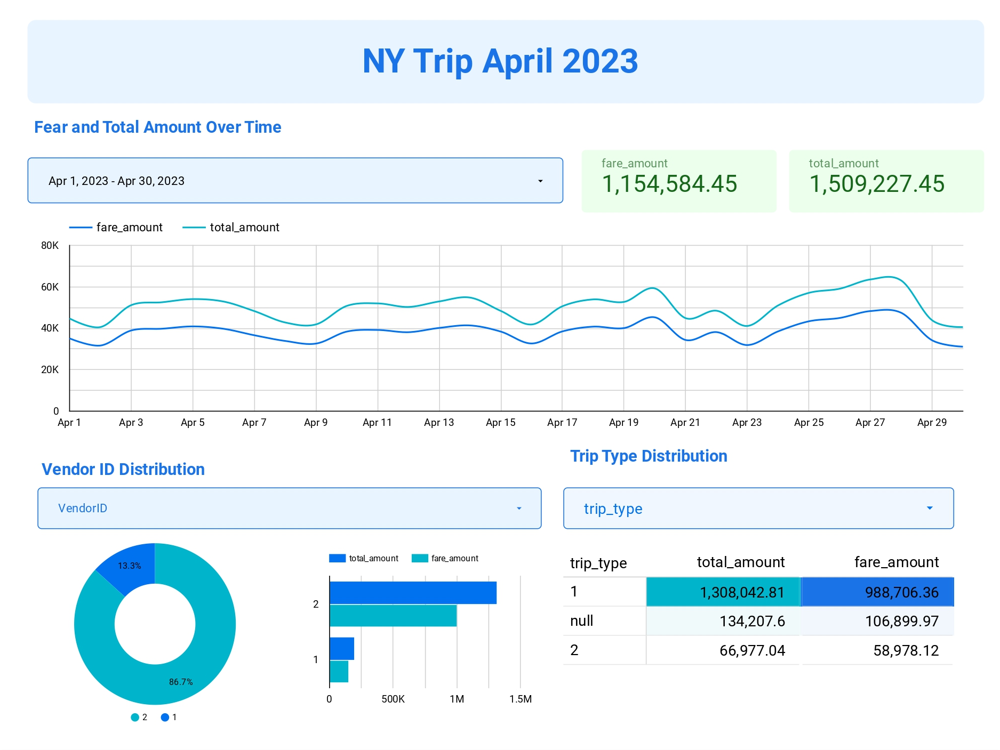

#  Visualization Using Looker Studio and BigQuery

Hello everyone, now I will try to give an overview of how Looker can create data visualizations from BigQuery! But before that, let's first understand what Looker Studio is...

### Looker Studio is ..

Looker Studio is a comprehensive data visualization and business intelligence platform offered by Looker, a leading data analytics company. It provides a suite of tools and features that enable users to explore, analyze, and visualize data from various sources in a user-friendly and intuitive manner.

Here's how you can prepare to use Looker Studio and create data visualizations from BigQuery:

A. Prepare BigQuery

1. Make sure you have a Google Cloud Platform account. If you don't have one, you can sign up at https://cloud.google.com/.
2. Once you have an account, navigate to the Google Cloud dashboard, and select BigQuery from the navigator menu.
3. Create a new dataset within your project. This is where you'll store and organize your data.
4. Upload your data to BigQuery from your local machine. You can use the data you mentioned from https://www.nyc.gov/site/tlc/about/tlc-trip-record-data.page as an example.
5. Once your data is loaded into BigQuery, you can proceed to Looker Studio.

Now, let's continue to Looker Studio
B. Visualize Data with Looker Studio

1. Go to https://lookerstudio.google.com/.
2. On the home page, click the "+Create" button and select "Data Source."
3. Choose the Google Connector option and select BigQuery.
4. In the project selection menu, choose the project you're working on, then select the dataset and table that contain the data you've uploaded. Finally, click the "Connect" button in the top right corner.
5. After connecting, you'll see the available data fields. You can also modify the default aggregation value in the "Default Aggregation" menu. Are you ready? Then click the "Create Report" button.
6. Voila! You can now create data visualizations using Looker Studio.

Here is an example visualization that I have created using Looker Studio. This is the result of my learning journey with Mr. Ricky Nauvaldy Ruliputra in the Data Engineering Fellowship Program 10 by IYKRA.

Or you can just visit this Link : [Visualization with Looker Studio and BigQuery](https://lookerstudio.google.com/reporting/b556a676-d989-4a7d-857f-112380d1dab0)